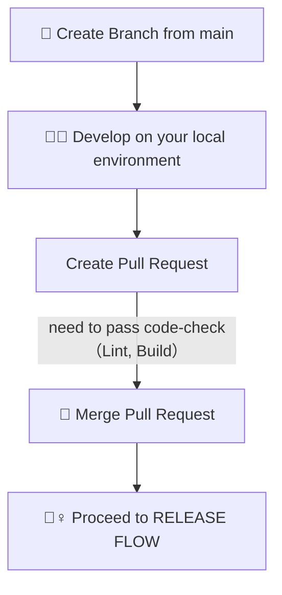
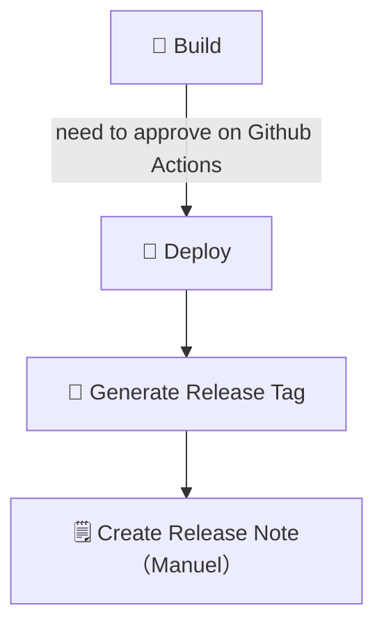
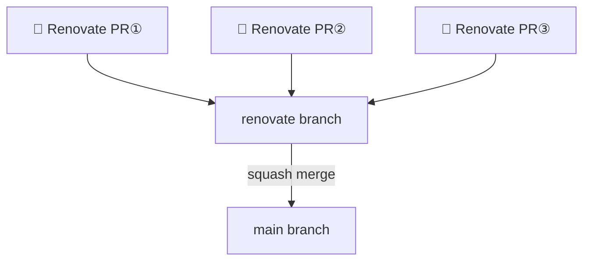

# PULL REQUEST FLOW

```mermaid
  graph TD
    A[🌱 Create Branch from main] --> B[🧑‍💻 Develop on your local environment]
    B --> C[Create Pull Request]
    C --> |need to pass code-check（Lint, Build）| D[🔀 Merge Pull Request]
    D --> E[🏃‍♀️ Proceed to RELEASE FLOW]
```

 

# RELEASE FLOW

```mermaid
  graph TD
    A[👷 Build] --> | need to approve on Github Actions | B[🚀 Deploy]
    B --> C[🔖 Generate Release Tag]
    C --> D[🗒️ Create Release Note（Manuel）]
```

 

# RENOVATE FLOW

```mermaid
  graph TD
    A[📃 Renovate PR①]
    B[📃 Renovate PR②]
    C[📃 Renovate PR③]
    D[renovate branch]
    E[main branch]
    A --> D
    B --> D
    C --> D
    D --> | squash merge | E
```
