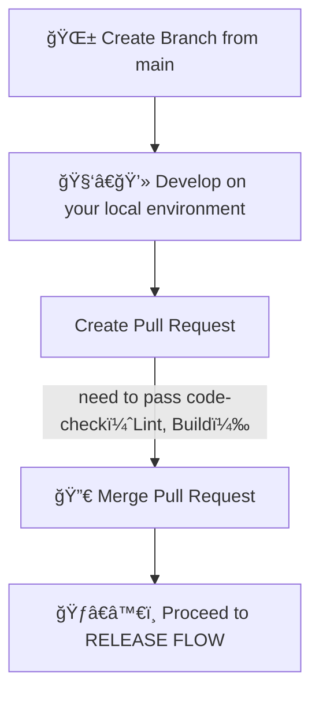
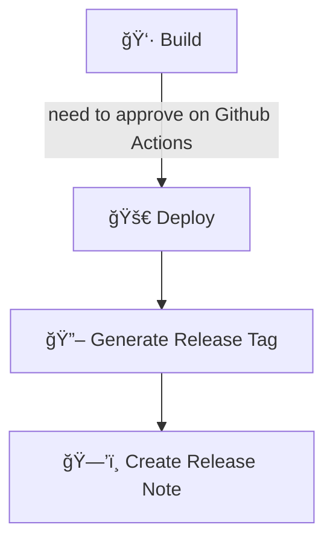

# PULL REQUEST FLOW

```mermaid
  graph TD
    A[🌱 Create Branch from main] --> B[🧑â€ğŸ’» Develop on your local environment]
    B --> C[Create Pull Request]
    C --> |need to pass code-check（Lint, Build）| D[🔀 Merge Pull Request]
    D --> E[ğŸƒâ€â™€ï¸ Proceed to RELEASE FLOW]
```

 

# RELEASE FLOW

```mermaid
  graph TD
    A[👷 Build] --> | need to approve on Github Actions | B[🚀 Deploy]
    B --> C[🔖 Generate Release Tag]
    C --> D[ğŸ—’ï¸ Create Release Note]
```
